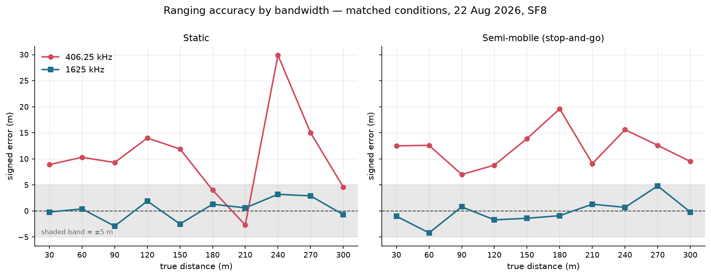
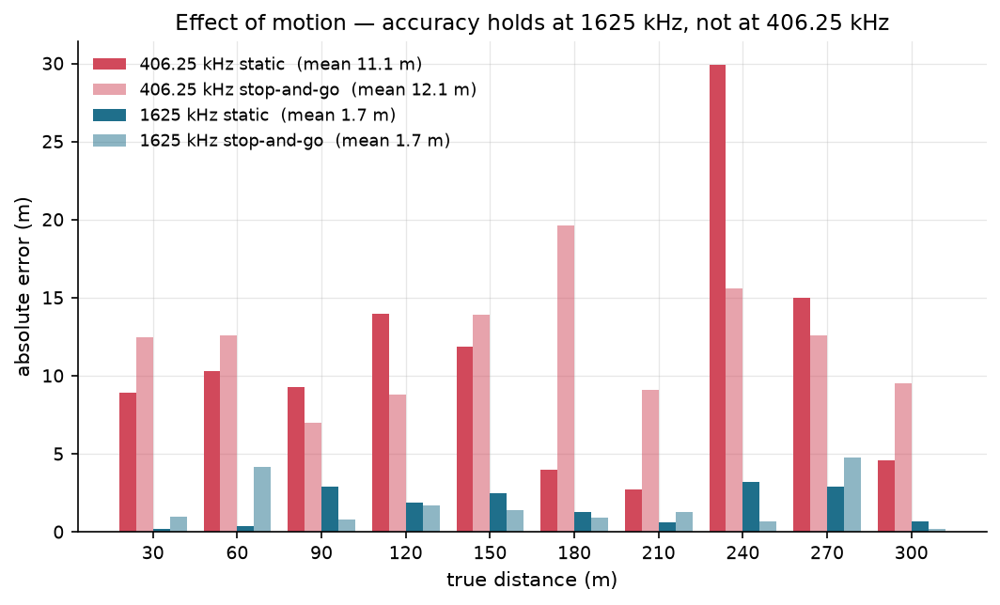
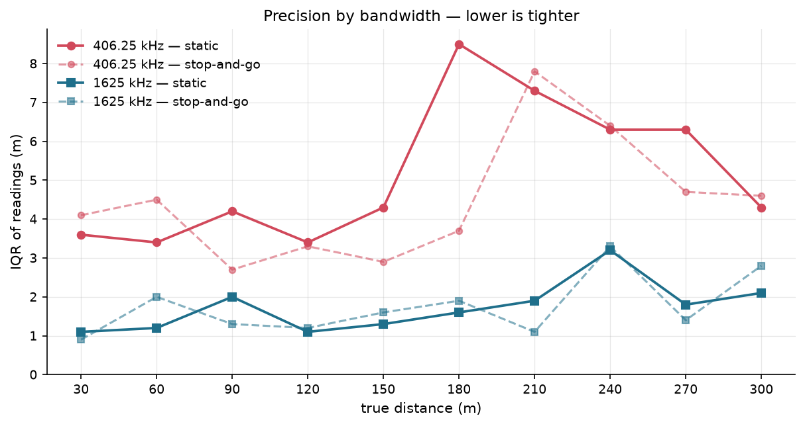

# Pack Pucks

**An open, commodity-hardware platform for peer-to-peer 2.4 GHz radio ranging — and the
field measurements it has produced.**

Two matchbox-sized devices tell each other how far apart they are, using nothing but the
travel time of a 2.4 GHz radio signal between them. No GPS. No phone. No cloud. No fixed
anchors. Each device shows the distance as a colour on an LED ring.

The demo is the easy half. The point of this repository is the measurement: firmware,
offload and QC tooling, the raw CSVs from every outing, and the analysis that produced
every number below — published so the ranging behaviour of the SX1280 on off-the-shelf
hardware can be checked rather than taken on trust.

> ### Headline result
>
> **22 August 2026 · ten tape-surveyed cones at 30 m spacing, 30–300 m · SF8 · both
> bandwidths run back to back on the same line**
>
> At **1625 kHz** the median range error stays inside **±5 m at every marker**, both with
> the endpoints static and with one carried. At **406.25 kHz** it does not — errors run
> **10–12 m long on average**, as a systematic bias rather than scatter. The wider
> bandwidth costs **4.7 % in cycle time**.
>
> **7,860 ranging exchanges across the two campaign outings: zero timeouts, zero errors.**

| Where to look | |
|---|---|
| [`data/README.md`](data/README.md) | Datasets — sites, weather, per-session provenance, every field deviation |
| [`data/analysis/2026-08-22_GMATownship_day2_qc_tables.md`](data/analysis/2026-08-22_GMATownship_day2_qc_tables.md) | The authoritative per-marker tables behind every figure here |
| [`firmware/`](firmware/) | Arduino/C++ sources, both roles, by build phase |
| [`docs/FSD.md`](docs/FSD.md) | Functional specification — requirements, pin map, CSV schemas |
| [`tools/`](tools/) | Offload, CSV validation, session QC, figure generation |

---

## Why build it

A group spread out along a forest trail, a trailhead, or a construction site has no
reliable way to answer *"how far away is everyone?"* GPS needs sky, mesh radios need a
network, and phones need both. Two pucks need only each other.

Pack Pucks is **GPS-independent by design** — no GPS receiver, no cellular link, no cloud
service, no fixed anchors. It has **not** been tested in GPS-denied conditions, and no
such claim is made: every measurement in this repository is outdoor and line-of-sight.
The system's output is a coarse range estimate; the LED colour bands are a demonstration
use case, not a research result.

---

## What was measured

| | |
|---|---|
| Site | Open ground, GMA township, Kota, Rajasthan |
| Markers | 10 traffic cones, 30 m spacing, 30 m → 300 m, tape-surveyed |
| Radio | SX1280 @ 2400.0 MHz, SF8, CR 4/7, 12 dBm, address `0x12345678` |
| Independent variable | **Bandwidth: 406.25 kHz vs 1625 kHz.** Nothing else changed. |
| Tier 1 — static | Both endpoints stationary; ~90–130 exchanges per marker |
| Tier 2 — semi-mobile | One endpoint carried 300 m → 30 m, pausing ~70 s at each cone |
| Tier 2 ground truth | Operator arrival log — phone stopwatch lapped at every dwell and transit |

Both bandwidths ran back to back on the same cone line, the same afternoon, at the same
spreading factor and the same power. That matching is the whole point: it is what isolates
bandwidth from site, weather, geometry and configuration.

---

## Results

### 1. Bandwidth dominates the error budget



| | 406.25 kHz | 1625 kHz | ratio |
|---|---|---|---|
| Mean absolute error — static | 11.1 m | **1.7 m** | 6.7× |
| Mean absolute error — semi-mobile | 12.1 m | **1.7 m** | 7.1× |
| Signed bias — static | **+10.5 m** | +0.4 m | — |
| Signed bias — semi-mobile | **+12.1 m** | −0.2 m | — |
| Worst single marker — static | **+29.9 m** (at 240 m) | +3.2 m (at 240 m) | — |
| Mean IQR — static | 5.2 m | **1.7 m** | 3.0× |
| Mean IQR — semi-mobile | 4.5 m | **1.8 m** | 2.6× |

Each cell aggregates ten per-marker values, where a marker's value is the median (or IQR)
of the SUCCESS rows recorded at it. Per-marker tables are in
[`data/analysis/2026-08-22_GMATownship_day2_qc_tables.md`](data/analysis/2026-08-22_GMATownship_day2_qc_tables.md).

The 406.25 kHz error is **directional, not noisy** — distances come back too long at nine
of ten markers when static, and at ten of ten when carried. A systematic bias of that
shape is a different problem from imprecision, and potentially a correctable one; that is
left for a calibration study, not asserted here.

### 2. Carrying one endpoint costs almost nothing — at the right bandwidth



At 1625 kHz, mean absolute error is **1.7 m whether both endpoints sit on tripods or one
is carried** — unchanged. At 406.25 kHz the bias is, if anything, slightly worse when
carried (11.1 → 12.1 m).

**What "semi-mobile" means here, precisely.** The carried endpoint is walked between
cones, but the analysed readings come from the ~70 s pause at each cone, not from the
walk. This is therefore a result about *semi-mobile stop-and-go operation*, not about
ranging at walking speed. Readings taken while actually in motion are future work, and no
claim is made about them.

Dwell windows come from the operator arrival log rather than being inferred from the data.
Where that log disagrees with the QC tool's nearest-marker heuristic — two of ten markers
at 406.25 kHz — the lap-window recomputation supersedes the tool, and the tool's own
report is left as generated so the disagreement stays visible.

### 3. Precision holds out to 300 m



1625 kHz stays between **0.9 m and 3.3 m** of interquartile spread across the whole
30–300 m span. 406.25 kHz runs **2.7 m to 8.5 m**, worst across the 180–270 m band.

### 4. The wider bandwidth is nearly free

Ranging cadence is set by the blocking RadioLib `range()` call, not by software pacing:

| Bandwidth | Cycle time | Rate | Basis |
|---|---|---|---|
| 1625 kHz | **655 ms** | 1.53 Hz | median of 2,649 inter-row deltas |
| 406.25 kHz | 686 ms | 1.46 Hz | median of 3,084 inter-row deltas |

Cutting bandwidth by 4× buys only **4.7 %** more time per cycle, because fixed overhead —
not airtime — dominates the exchange. A cycle that receives *no* reply is a different
story: RadioLib runs out a fixed 10 s guard (≈ 10.6 s measured), so cadence collapses
wherever timeouts are frequent. Neither campaign outing recorded one.

### Practical conclusion

**Use 1625 kHz.** On this hardware the narrow setting costs roughly 7× in accuracy and 3×
in precision, and returns under 5 % in duty cycle. Reach is not the trade-off either: a
separate pilot outing at 1625 kHz was still ranging at a **365 m** median when the ground
ran out — though that outing was never surveyed, so no accuracy figure can be read from it.

---

## Where this sits in the literature

| Prior work | Hardware | Bandwidth comparison | Mobility |
|---|---|---|---|
| Wolf et al., WPNC 2019 | Unreleased SX1280 dev-kit + Raspberry Pi | 406.25 vs 1625 kHz, dedicated | static |
| Andersen et al., WF-IoT 2020 | SX1280 dev-kit | 400 / 800 / 1600 kHz sweep to 100 m | static |
| Müller et al., ICL-GNSS 2021 | SX1280 | 406 kHz only | one node walking |
| Gottschalk et al., *Internet of Things* 2026 | SX1280, anchor-based 2D | 800 vs 1600 kHz; 400 kHz tested and excluded | anchor + pedestrian |
| Albinsaid et al., arXiv 2025 | custom hardware | — | localization framework |
| Salimzhanova et al., CSCN 2024 | open SX1280 testbed | — | *communication*, not ranging |

Every bandwidth comparison above is static. Every semi-mobile result above is
single-bandwidth. Gottschalk et al. explicitly defer systematic low-bandwidth
investigation to future work.

To the best of my knowledge, this repository provides **the first matched 406.25-vs-1625
kHz comparison under semi-mobile stop-and-go, peer-to-peer conditions with one endpoint
human-carried**, on commodity hardware with the raw data published — alongside an open,
reproducible platform for that class of measurement, distinct from unreleased dev-kit
benchmarking rigs, custom-hardware localization frameworks, and open *communication*
testbeds.

The static tier is **not new**. It is a replication of Wolf et al. on off-the-shelf parts,
and is reported as replication. No novel per-exchange radio effect is claimed.

---

## What these numbers do not say

A short, honest list. The full version is in [`data/README.md`](data/README.md) and the
per-session logs.

- **There is no error bound on the ground truth.** Cones were surveyed with a class III
  fibreglass tape, whose instrument tolerance is ±1.3 cm at 30 m and ±12 cm at 300 m. But
  tape sag, tension and leapfrog accumulation across ten segments were never measured, so
  **no total tolerance is stated and none has been invented.** Treat every accuracy figure
  here as having no error bars yet.
- **One outing carries the comparison.** The matched 406.25-vs-1625 kHz result rests on
  22 August alone. The 15 August outing ran one bandwidth and is explicitly *not*
  contribution-grade — attempt counts below specification, no arrival log.
- **Mount height and carry position were not recorded on 22 August.** Antenna height
  differs silently between a tripod-mounted and a hand-carried endpoint, and this outing
  cannot say by how much. It is logged as an open item, not quietly reconstructed.
- **The 240 m cone misbehaves, repeatably.** It deviates on both outings, and far more at
  the lower bandwidth (+29.9 m at 406.25 kHz against +3.2 m at 1625 kHz), beside a
  recorded structure. That is the profile of multipath at a fixed reflector — but two
  outings at one cone is an observation, not a result. Flagged for targeted
  re-measurement, not interpreted.
- **The pilot outing has no ground truth at all.** Its 365 m reach is a range
  demonstration; positions were paced, not surveyed. No accuracy figure is derivable
  from it.
- **Nothing here speaks to continuous motion.** See result 2 above.

---

## Reproducing every figure

Raw CSVs are opened read-only and never modified — no ground truth was ever written back
into them, which is why per-file truth lives in `session_plan.json` instead. Every report
and figure regenerates from the published data:

```bash
python tools/qc_session.py --data-dir data/ranging_experiments/2026-08-22_GMATownship_session02/raw/20260822_174415-Initiator --out qc_out --session-plan data/analysis/2026-08-22_GMATownship_174415_qc/session_plan.json --expect-bw 1625.0
```

```bash
python tools/make_readme_figures.py
```

For the 406.25 kHz run add `--expect-bw 406.25 --cadence-ms 686.0`. Regenerating
reproduces the committed reports exactly; only the generation timestamp differs.

---

## Build one

### Hardware

| Component | Part |
|---|---|
| MCU + radio | LILYGO T3-S3 V1.2 — ESP32-S3 + Semtech SX1280, *Without PA* (H594) × 2 |
| Output | WS2812B 16-LED ring × 2, on GPIO 38 |
| Power | USB-C — laptop, wall adapter or power bank |
| Antenna | SMA, finger-tight |

Both boards run the same code with one compile-time switch. One is the Initiator and
drives the exchange; the other answers.

### Toolchain

Arduino IDE 2.x with ESP32 board support, plus **RadioLib** (Jan Gromeš) and **FastLED**
(Daniel Garcia) from the Library Manager.

### Flash

1. Open the sketch for the phase you want from `firmware/`.
2. Board **LilyGo T3-S3**, Board Revision **Radio-SX1280**.
3. Enable **USB CDC On Boot**; PSRAM **QSPI PSRAM**; Partition Scheme
   **Default 4MB with spiffs**.
4. Set the role — `#define ROLE_INITIATOR` on one board, `#define ROLE_RESPONDER` on the
   other. There is no runtime switching.
5. Flash both, then open Serial Monitor at 115200 baud.

The boot banner reports firmware version, board ID and the full radio configuration, and
confirms WiFi and Bluetooth are off. If either fails to disable, the board faults rather
than collecting data.

### Radio configuration

One `#define` block drives `radio.begin()`, the boot banner and the CSV header, so every
logged file self-describes the settings that produced it.

```cpp
#define RADIO_FREQ_MHZ     2400.0f  // MHz
#define RADIO_BW_KHZ       1625.0f  // kHz — or 406.25f
#define RADIO_SF           8        // spreading factor
#define RADIO_CR           7        // coding rate 4/7
#define RADIO_TX_POWER_DBM 12       // H594 hardware max ~12.5 dBm
#define RADIO_ADDRESS      0x12345678
```

Two notes that cost time to discover. Semtech's documentation labels the 1625 kHz setting
"1600 kHz", but the hardware register is 52 MHz / 32 = 1625 kHz — and RadioLib rejects
`1600.0` and `400.0` outright. The address must match on both boards or they will never
pair.

### Collecting data

Logs are written to on-board flash as CSV and pulled off over serial afterwards:

```bash
python tools/offload/offload.py --port COM8 --session-id 20260822_site
```

The script prompts for session metadata, converts local timestamps to UTC, validates every
file against the DR-1/DR-2 schema, verifies it against a byte-count manifest, and only
then offers to wipe the flash — a file that fails validation blocks the wipe. Wipe between
outings: leaving it unwiped is how one of our own offloads ended up mixing three firmware
versions' worth of stale recordings into what looked like a single session.

---

## Repository layout

```
firmware/   Arduino sketches by phase — 01_blink, 02_radio_comms, 03_ranging
tools/      offload.py + validate_csv.py   flash -> verified CSV
            qc_session.py                  per-session QC reports and figures
            make_readme_figures.py         the cross-bandwidth figures above
data/
  ranging_experiments/   raw CSVs, manifests, session logs, field notes, weather
  analysis/              generated QC reports, per-marker tables, figures
docs/FSD.md              functional specification — requirements, interfaces, schemas
```

---

## Status

**Working today:** two-board ranging at both bandwidths, on-device CSV logging, the
offload / validation / QC pipeline, and three completed field outings across two sites.

**Next:** closing the ground-truth error bound with a sag and tension estimate;
re-measuring the 240 m anomaly at both bandwidths with site photographs; recording mount
and carry geometry; and a second matched outing so the bandwidth comparison rests on more
than one day.

**Paper:** a Part 1 preprint covering the platform and this characterisation is in
preparation, targeted at arXiv for late 2026. The full experimental protocol
(`Methodology.md`) — survey procedure, sample sizes, session structure, environmental
logging, and the discard criteria the QC tool enforces — will be published alongside it,
and is available on request before then.

**Out of scope for now:** battery operation, ranging while both endpoints are in
continuous motion, indoor multipath characterisation, crash detection, and ranging between
more than two devices.

---

## Documentation

| Document | Purpose |
|---|---|
| [`docs/FSD.md`](docs/FSD.md) | Functional specification — requirements, interfaces, data schemas, acceptance criteria |
| [`data/README.md`](data/README.md) | Datasets — sites, conditions, per-session provenance, limitations, reproduction |
| [`data/analysis/2026-08-22_GMATownship_day2_qc_tables.md`](data/analysis/2026-08-22_GMATownship_day2_qc_tables.md) | Per-marker numbers behind every figure in this README |
| [`tools/qc_session.py`](tools/qc_session.py) | Session QC tool — generates every report and figure under `data/analysis/` |

---

## Author

Built and measured by **Ishan Raonka** — [ishan.raonka.com](https://ishan.raonka.com/).

Corrections, replication attempts, and requests for `Methodology.md` are welcome: open an
issue on this repository.

## License

Not yet set. The firmware, tools and datasets here are published for inspection and
replication; a formal licence will be attached before the preprint goes live.
