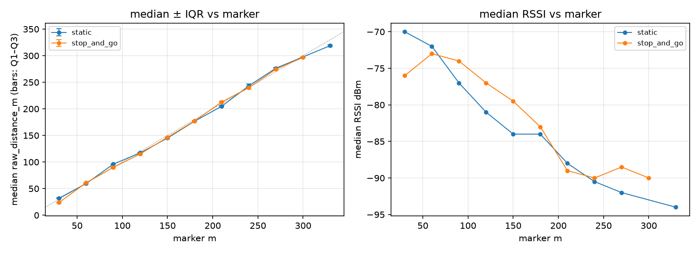

# Outing summary — run comparison at matched markers

- Session dir: `data/ranging_experiments/2026-08-15_GMATownship_session01/raw/20260815_184714-Initiator`
- Generated: 2026-09-10 23:37 UTC by qc_session.py v1.0.0
- Run `static`: **PASS** (see `static/report.md`)
- Run `stop_and_go`: **PASS** (see `stop_and_go/report.md`)
- Run `unassigned`: **PASS** (see `unassigned/report.md`)

Runs with no marker-attributable data (excluded from the comparison table): `unassigned`

| marker m | static median m | static IQR m | static err m | static T% | static RSSI | stop_and_go median m | stop_and_go IQR m | stop_and_go err m | stop_and_go T% | stop_and_go RSSI |
|---|---|---|---|---|---|---|---|---|---|---|
| 30 | 32.0 | 1.3 | +2.0 | 0 | -70 | 23.9 | 2.2 | -6.1 | 0 | -76 |
| 60 | 59.5 | 1.1 | -0.5 | 0 | -72 | 61.0 | 1.3 | +1.0 | 0 | -73 |
| 90 | 96.0 | 1.0 | +6.0 | 0 | -77 | 89.9 | 1.2 | -0.1 | 0 | -74 |
| 120 | 117.4 | 1.3 | -2.6 | 0 | -81 | 115.4 | 1.9 | -4.6 | 0 | -77 |
| 150 | 145.1 | 1.6 | -4.9 | 0 | -84 | 146.4 | 1.7 | -3.6 | 0 | -80 |
| 180 | 176.8 | 1.5 | -3.2 | 0 | -84 | 177.4 | 2.1 | -2.6 | 0 | -83 |
| 210 | 205.0 | 2.5 | -5.0 | 0 | -88 | 212.9 | 2.5 | +2.9 | 0 | -89 |
| 240 | 243.3 | 5.5 | +3.3 | 0 | -90 | 239.9 | 4.6 | -0.1 | 0 | -90 |
| 270 | 276.6 | 2.4 | +6.6 | 0 | -92 | 274.6 | 2.3 | +4.6 | 0 | -88 |
| 300 | — | — | — | — | — | 296.8 | 2.1 | -3.2 | 0 | -90 |
| 330 | 318.9 | 4.2 | -11.1 | 0 | -94 | — | — | — | — | — |

Timeout % uses the all-outcomes attempt denominator. Stop-and-go rows come from heuristic dwell segmentation — verify marker matching against the session log.

