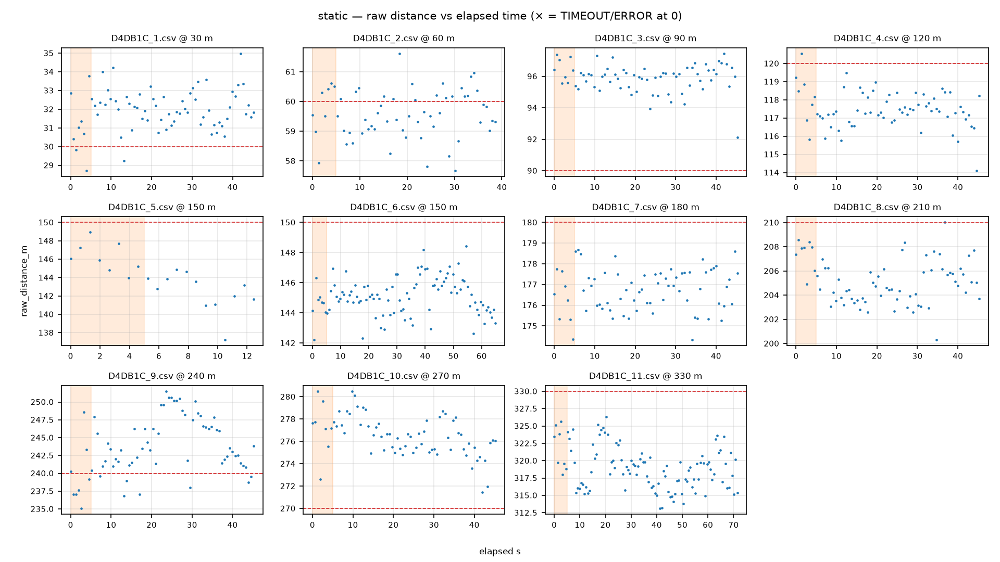

# QC report — run `static` (static)

- Session dir: `data/ranging_experiments/2026-08-15_GMATownship_session01/raw/20260815_184714-Initiator`
- Generated: 2026-09-10 23:37 UTC by qc_session.py v1.0.0 (raw CSVs read-only, unmodified)
- Expected config: 2400.0 MHz, BW 1625.0 kHz, SF8, CR 4/7, 12 dBm; N=100/file; cadence 655.0 ms ±5%; drift limit 15.0 m; warm-up window 5.0 s
- Ground truth: session plan `session_plan.json` (operator-supplied; used only where CSV line-2 TRUE_DISTANCE_M is absent)

## Verdict: **PASS**

No machine-checkable Methodology §11 discard trigger found in this run.

> The following Methodology §11 discard criteria are **not machine-checkable from CSVs** and must be confirmed against the session log: (a) cone moved mid-session without re-measurement; (b) material weather change mid-session (rain start, wind category shift). This tool checks only: firmware reboot / power-loss evidence (short or truncated files), and the >10-consecutive-ERROR abort criterion.

## 1. Manifest integrity

| file | manifest expected | manifest actual | on-disk | status | ok |
|---|---|---|---|---|---|
| `pucklog_D4DB1C_1.csv` | 3161 | 3161 | 3161 | OK | ✓ |
| `pucklog_D4DB1C_2.csv` | 2741 | 2741 | 2741 | OK | ✓ |
| `pucklog_D4DB1C_3.csv` | 3161 | 3161 | 3161 | OK | ✓ |
| `pucklog_D4DB1C_4.csv` | 3231 | 3231 | 3231 | OK | ✓ |
| `pucklog_D4DB1C_5.csv` | 1081 | 1081 | 1081 | OK | ✓ |
| `pucklog_D4DB1C_6.csv` | 4522 | 4522 | 4522 | OK | ✓ |
| `pucklog_D4DB1C_7.csv` | 3231 | 3231 | 3231 | OK | ✓ |
| `pucklog_D4DB1C_8.csv` | 3231 | 3231 | 3231 | OK | ✓ |
| `pucklog_D4DB1C_9.csv` | 3231 | 3231 | 3231 | OK | ✓ |
| `pucklog_D4DB1C_10.csv` | 3231 | 3231 | 3231 | OK | ✓ |
| `pucklog_D4DB1C_11.csv` | 4962 | 4962 | 4962 | OK | ✓ |

## 2. Per-file checks

| file | truth (src) | N | vs spec | cadence ms | S / T / E (rate) | max ERR streak | drift m | flags |
|---|---|---|---|---|---|---|---|---|
| `pucklog_D4DB1C_1.csv` | 30.0 (session-plan) | 70 | -30 | 655 | 70 (100%) / 0 (0%) / 0 (0%) | 0 | 1.8 | 2 |
| `pucklog_D4DB1C_2.csv` | 60.0 (session-plan) | 60 | -40 | 655 | 60 (100%) / 0 (0%) / 0 (0%) | 0 | 1.0 | 2 |
| `pucklog_D4DB1C_3.csv` | 90.0 (session-plan) | 70 | -30 | 655 | 70 (100%) / 0 (0%) / 0 (0%) | 0 | 0.9 | 2 |
| `pucklog_D4DB1C_4.csv` | 120.0 (session-plan) | 70 | -30 | 655 | 70 (100%) / 0 (0%) / 0 (0%) | 0 | 1.4 | 2 |
| `pucklog_D4DB1C_5.csv` | 150.0 (session-plan) | 20 | -80 DISCARDED | 655 | 20 (100%) / 0 (0%) / 0 (0%) | 0 | 4.2 | 3 |
| `pucklog_D4DB1C_6.csv` | 150.0 (session-plan) | 100 | OK | 655 | 100 (100%) / 0 (0%) / 0 (0%) | 0 | 2.1 | 1 |
| `pucklog_D4DB1C_7.csv` | 180.0 (session-plan) | 70 | -30 | 655 | 70 (100%) / 0 (0%) / 0 (0%) | 0 | 1.4 | 2 |
| `pucklog_D4DB1C_8.csv` | 210.0 (session-plan) | 70 | -30 | 655 | 70 (100%) / 0 (0%) / 0 (0%) | 0 | 4.3 | 2 |
| `pucklog_D4DB1C_9.csv` | 240.0 (session-plan) | 70 | -30 | 655 | 70 (100%) / 0 (0%) / 0 (0%) | 0 | 11.2 | 2 |
| `pucklog_D4DB1C_10.csv` | 270.0 (session-plan) | 70 | -30 | 655 | 70 (100%) / 0 (0%) / 0 (0%) | 0 | 4.0 | 2 |
| `pucklog_D4DB1C_11.csv` | 330.0 (session-plan) | 110 | OK | 655 | 110 (100%) / 0 (0%) / 0 (0%) | 0 | 8.2 | 1 |

All three outcomes count toward the attempt denominator.

### radio_status_code distribution (non-SUCCESS rows)

No non-SUCCESS rows in this run.

## 3. Warm-up (first 5 s vs remainder, SUCCESS rows)

| file | warm-up rows | warm-up median m | rest median m | delta m |
|---|---|---|---|---|
| `pucklog_D4DB1C_1.csv` | 8 | 30.9 | 32.1 | -1.2 |
| `pucklog_D4DB1C_2.csv` | 8 | 59.9 | 59.5 | +0.4 |
| `pucklog_D4DB1C_3.csv` | 8 | 96.4 | 96.0 | +0.4 |
| `pucklog_D4DB1C_4.csv` | 8 | 118.3 | 117.3 | +1.0 |
| `pucklog_D4DB1C_5.csv` | 8 | 146.0 | 143.0 | +3.0 |
| `pucklog_D4DB1C_6.csv` | 8 | 144.7 | 145.2 | -0.5 |
| `pucklog_D4DB1C_7.csv` | 8 | 176.4 | 176.8 | -0.5 |
| `pucklog_D4DB1C_8.csv` | 8 | 207.9 | 204.6 | +3.4 |
| `pucklog_D4DB1C_9.csv` | 8 | 238.4 | 243.5 | -5.1 |
| `pucklog_D4DB1C_10.csv` | 8 | 277.4 | 276.4 | +1.0 |
| `pucklog_D4DB1C_11.csv` | 8 | 321.6 | 318.7 | +2.9 |

Sanity check for the Methodology §7.2 first-5-s discard rule; large deltas indicate the discard window matters for that file.

## 4. Per-marker statistics (SUCCESS rows)

| marker m | file | n | median m | Q1–Q3 m | IQR m | min m | max m | median RSSI | signed err m |
|---|---|---|---|---|---|---|---|---|---|
| 30 | `pucklog_D4DB1C_1.csv` | 70 | 32.0 | 31.3–32.6 | 1.3 | 28.7 | 35.0 | -70 | +2.0 |
| 60 | `pucklog_D4DB1C_2.csv` | 60 | 59.5 | 59.0–60.2 | 1.1 | 57.7 | 61.6 | -72 | -0.5 |
| 90 | `pucklog_D4DB1C_3.csv` | 70 | 96.0 | 95.4–96.4 | 1.0 | 92.1 | 97.4 | -77 | +6.0 |
| 120 | `pucklog_D4DB1C_4.csv` | 70 | 117.4 | 117.0–118.2 | 1.3 | 114.1 | 120.5 | -81 | -2.6 |
| 150 | `pucklog_D4DB1C_6.csv` | 100 | 145.1 | 144.2–145.8 | 1.6 | 142.2 | 148.4 | -84 | -4.9 |
| 180 | `pucklog_D4DB1C_7.csv` | 70 | 176.8 | 176.0–177.5 | 1.5 | 174.3 | 178.7 | -84 | -3.2 |
| 210 | `pucklog_D4DB1C_8.csv` | 70 | 205.0 | 203.7–206.2 | 2.5 | 200.3 | 210.0 | -88 | -5.0 |
| 240 | `pucklog_D4DB1C_9.csv` | 70 | 243.3 | 241.1–246.6 | 5.5 | 235.1 | 251.5 | -90 | +3.3 |
| 270 | `pucklog_D4DB1C_10.csv` | 70 | 276.6 | 275.3–277.7 | 2.4 | 271.4 | 280.5 | -92 | +6.6 |
| 330 | `pucklog_D4DB1C_11.csv` | 110 | 318.9 | 316.4–320.6 | 4.2 | 313.1 | 326.3 | -94 | -11.1 |

Ground-truth source(s): session-plan.

## 5. Deviations and anomalies

- `pucklog_D4DB1C_1.csv`: operator metadata line (line 2) absent — SITE/RUN_ID/TRUE_DISTANCE_M not recorded in file (Methodology §7.4 step incomplete)
- `pucklog_D4DB1C_1.csv`: N=70 attempts vs spec N=100 (shortfall 30)
- `pucklog_D4DB1C_2.csv`: operator metadata line (line 2) absent — SITE/RUN_ID/TRUE_DISTANCE_M not recorded in file (Methodology §7.4 step incomplete)
- `pucklog_D4DB1C_2.csv`: N=60 attempts vs spec N=100 (shortfall 40)
- `pucklog_D4DB1C_3.csv`: operator metadata line (line 2) absent — SITE/RUN_ID/TRUE_DISTANCE_M not recorded in file (Methodology §7.4 step incomplete)
- `pucklog_D4DB1C_3.csv`: N=70 attempts vs spec N=100 (shortfall 30)
- `pucklog_D4DB1C_4.csv`: operator metadata line (line 2) absent — SITE/RUN_ID/TRUE_DISTANCE_M not recorded in file (Methodology §7.4 step incomplete)
- `pucklog_D4DB1C_4.csv`: N=70 attempts vs spec N=100 (shortfall 30)
- `pucklog_D4DB1C_5.csv`: operator metadata line (line 2) absent — SITE/RUN_ID/TRUE_DISTANCE_M not recorded in file (Methodology §7.4 step incomplete)
- `pucklog_D4DB1C_5.csv`: N=20 attempts vs spec N=100 (shortfall 80)
- `pucklog_D4DB1C_5.csv`: only 20 attempts (<50% of spec) — possible mid-run power-cycle/reboot; operator disposition: DISCARDED (operator (2026-08-21): bad run, redone as pucklog_D4DB1C_6.csv) — excluded from per-marker stats; move to data/discarded/ at archive time (Methodology §11)
- `pucklog_D4DB1C_6.csv`: operator metadata line (line 2) absent — SITE/RUN_ID/TRUE_DISTANCE_M not recorded in file (Methodology §7.4 step incomplete)
- `pucklog_D4DB1C_7.csv`: operator metadata line (line 2) absent — SITE/RUN_ID/TRUE_DISTANCE_M not recorded in file (Methodology §7.4 step incomplete)
- `pucklog_D4DB1C_7.csv`: N=70 attempts vs spec N=100 (shortfall 30)
- `pucklog_D4DB1C_8.csv`: operator metadata line (line 2) absent — SITE/RUN_ID/TRUE_DISTANCE_M not recorded in file (Methodology §7.4 step incomplete)
- `pucklog_D4DB1C_8.csv`: N=70 attempts vs spec N=100 (shortfall 30)
- `pucklog_D4DB1C_9.csv`: operator metadata line (line 2) absent — SITE/RUN_ID/TRUE_DISTANCE_M not recorded in file (Methodology §7.4 step incomplete)
- `pucklog_D4DB1C_9.csv`: N=70 attempts vs spec N=100 (shortfall 30)
- `pucklog_D4DB1C_10.csv`: operator metadata line (line 2) absent — SITE/RUN_ID/TRUE_DISTANCE_M not recorded in file (Methodology §7.4 step incomplete)
- `pucklog_D4DB1C_10.csv`: N=70 attempts vs spec N=100 (shortfall 30)
- `pucklog_D4DB1C_11.csv`: operator metadata line (line 2) absent — SITE/RUN_ID/TRUE_DISTANCE_M not recorded in file (Methodology §7.4 step incomplete)

