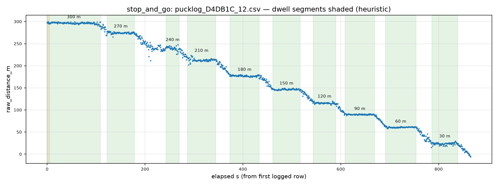

# QC report — run `stop_and_go` (stop_and_go)

- Session dir: `data/ranging_experiments/2026-08-15_GMATownship_session01/raw/20260815_184714-Initiator`
- Generated: 2026-09-10 23:37 UTC by qc_session.py v1.0.0 (raw CSVs read-only, unmodified)
- Expected config: 2400.0 MHz, BW 1625.0 kHz, SF8, CR 4/7, 12 dBm; N=100/file; cadence 655.0 ms ±5%; drift limit 15.0 m; warm-up window 5.0 s
- Ground truth: session plan `session_plan.json` (operator-supplied; used only where CSV line-2 TRUE_DISTANCE_M is absent)

## Verdict: **PASS**

No machine-checkable Methodology §11 discard trigger found in this run.

> The following Methodology §11 discard criteria are **not machine-checkable from CSVs** and must be confirmed against the session log: (a) cone moved mid-session without re-measurement; (b) material weather change mid-session (rain start, wind category shift). This tool checks only: firmware reboot / power-loss evidence (short or truncated files), and the >10-consecutive-ERROR abort criterion.

## 1. Manifest integrity

| file | manifest expected | manifest actual | on-disk | status | ok |
|---|---|---|---|---|---|
| `pucklog_D4DB1C_12.csv` | 59280 | 59280 | 59280 | OK | ✓ |

## 2. Per-file checks

| file | truth (src) | N | vs spec | cadence ms | S / T / E (rate) | max ERR streak | drift m | flags |
|---|---|---|---|---|---|---|---|---|
| `pucklog_D4DB1C_12.csv` | — | 1320 | OK | 656 | 1320 (100%) / 0 (0%) / 0 (0%) | 0 | — | 1 |

All three outcomes count toward the attempt denominator.

### radio_status_code distribution (non-SUCCESS rows)

No non-SUCCESS rows in this run.

## 3. Warm-up (first 5 s vs remainder, SUCCESS rows)

| file | warm-up rows | warm-up median m | rest median m | delta m |
|---|---|---|---|---|
| `pucklog_D4DB1C_12.csv` | 8 | 297.3 | 174.4 | +123.0 |

Sanity check for the Methodology §7.2 first-5-s discard rule; large deltas indicate the discard window matters for that file.

## 4. Dwell segmentation (heuristic)

Stationary plateaus detected via rolling-median slope < 5.0 m over ±5 cycles, minimum 30 cycles. Segment→marker matching is nearest-marker; verify against the session log.

| window s | matched marker | attempts | T / E | median m | IQR m | median RSSI |
|---|---|---|---|---|---|---|
| 0–109 | 300 | 167 | 0 / 0 | 296.8 | 2.1 | -90 |
| 123–178 | 270 | 86 | 0 / 0 | 274.6 | 2.3 | -88 |
| 243–270 | 240 | 43 | 0 / 0 | 239.9 | 4.6 | -90 |
| 287–344 | 210 | 89 | 0 / 0 | 212.9 | 2.5 | -89 |
| 373–434 | 180 | 93 | 0 / 0 | 177.4 | 2.1 | -83 |
| 461–517 | 150 | 86 | 0 / 0 | 146.4 | 1.7 | -80 |
| 544–590 | 120 | 71 | 0 / 0 | 115.4 | 1.9 | -77 |
| 609–669 | 90 | 93 | 0 / 0 | 89.9 | 1.2 | -74 |
| 691–754 | 60 | 96 | 0 / 0 | 61.0 | 1.3 | -73 |
| 786–839 | 30 | 82 | 0 / 0 | 23.9 | 2.2 | -76 |

## 5. Per-marker statistics (SUCCESS rows)

| marker m | file | n | median m | Q1–Q3 m | IQR m | min m | max m | median RSSI | signed err m |
|---|---|---|---|---|---|---|---|---|---|
| 30 | `pucklog_D4DB1C_12.csv` | 82 | 23.9 | 22.7–24.9 | 2.2 | 18.1 | 29.8 | -76 | -6.1 |
| 60 | `pucklog_D4DB1C_12.csv` | 96 | 61.0 | 60.3–61.6 | 1.3 | 58.5 | 63.3 | -73 | +1.0 |
| 90 | `pucklog_D4DB1C_12.csv` | 93 | 89.9 | 89.2–90.4 | 1.2 | 87.7 | 92.1 | -74 | -0.1 |
| 120 | `pucklog_D4DB1C_12.csv` | 71 | 115.4 | 114.7–116.6 | 1.9 | 111.5 | 120.0 | -77 | -4.6 |
| 150 | `pucklog_D4DB1C_12.csv` | 86 | 146.4 | 145.6–147.3 | 1.7 | 143.0 | 149.6 | -80 | -3.6 |
| 180 | `pucklog_D4DB1C_12.csv` | 93 | 177.4 | 176.1–178.2 | 2.1 | 171.5 | 180.8 | -83 | -2.6 |
| 210 | `pucklog_D4DB1C_12.csv` | 89 | 212.9 | 211.7–214.1 | 2.5 | 202.6 | 223.6 | -89 | +2.9 |
| 240 | `pucklog_D4DB1C_12.csv` | 43 | 239.9 | 237.7–242.3 | 4.6 | 226.3 | 248.1 | -90 | -0.1 |
| 270 | `pucklog_D4DB1C_12.csv` | 86 | 274.6 | 273.5–275.7 | 2.3 | 265.4 | 278.7 | -88 | +4.6 |
| 300 | `pucklog_D4DB1C_12.csv` | 167 | 296.8 | 295.8–297.9 | 2.1 | 288.9 | 299.7 | -90 | -3.2 |

Ground-truth source(s): plan markers + dwell match.

## 6. Deviations and anomalies

- `pucklog_D4DB1C_12.csv`: operator metadata line (line 2) absent — SITE/RUN_ID/TRUE_DISTANCE_M not recorded in file (Methodology §7.4 step incomplete)

