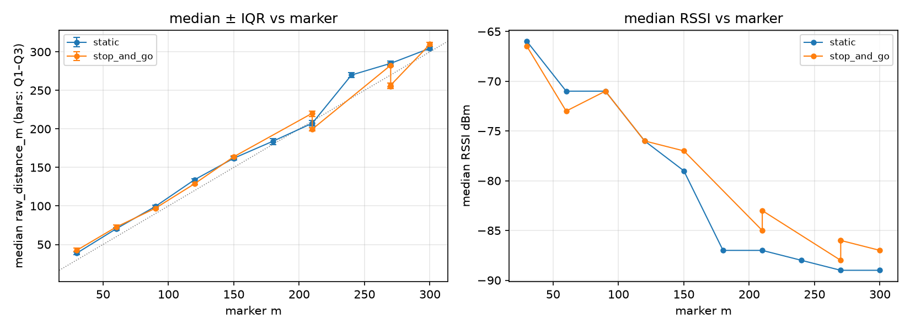

# Outing summary — run comparison at matched markers

- Session dir: `data/ranging_experiments/2026-08-22_GMATownship_session02/raw/20260822_162424-Initiator`
- Generated: 2026-09-10 23:36 UTC by qc_session.py v1.0.0
- Run `static`: **HOLD** (see `static/report.md`)
- Run `stop_and_go`: **PASS** (see `stop_and_go/report.md`)
- Run `unassigned`: **PASS** (see `unassigned/report.md`)

Runs with no marker-attributable data (excluded from the comparison table): `unassigned`

| marker m | static median m | static IQR m | static err m | static T% | static RSSI | stop_and_go median m | stop_and_go IQR m | stop_and_go err m | stop_and_go T% | stop_and_go RSSI |
|---|---|---|---|---|---|---|---|---|---|---|
| 30 | 38.9 | 3.6 | +8.9 | 0 | -66 | 42.5 | 4.1 | +12.5 | 0 | -66 |
| 60 | 70.3 | 3.4 | +10.3 | 0 | -71 | 72.6 | 4.6 | +12.6 | 0 | -73 |
| 90 | 99.3 | 4.2 | +9.3 | 0 | -71 | 97.0 | 2.9 | +7.0 | 0 | -71 |
| 120 | 134.0 | 3.4 | +14.0 | 0 | -76 | 128.8 | 3.4 | +8.8 | 0 | -76 |
| 150 | 161.9 | 4.3 | +11.9 | 0 | -79 | 163.8 | 3.2 | +13.8 | 0 | -77 |
| 180 | 184.0 | 8.5 | +4.0 | 0 | -87 | — | — | — | — | — |
| 210 | 207.3 | 7.3 | -2.7 | 0 | -87 | 199.6 | 4.1 | -10.4 | 0 | -83 |
| 240 | 269.9 | 6.3 | +29.9 | 0 | -88 | — | — | — | — | — |
| 270 | 285.0 | 6.3 | +15.0 | 0 | -89 | 282.6 | 4.7 | +12.6 | 0 | -88 |
| 300 | 304.6 | 4.3 | +4.6 | 0 | -89 | 309.8 | 4.8 | +9.8 | 0 | -87 |

Timeout % uses the all-outcomes attempt denominator. Stop-and-go rows come from heuristic dwell segmentation — verify marker matching against the session log.

