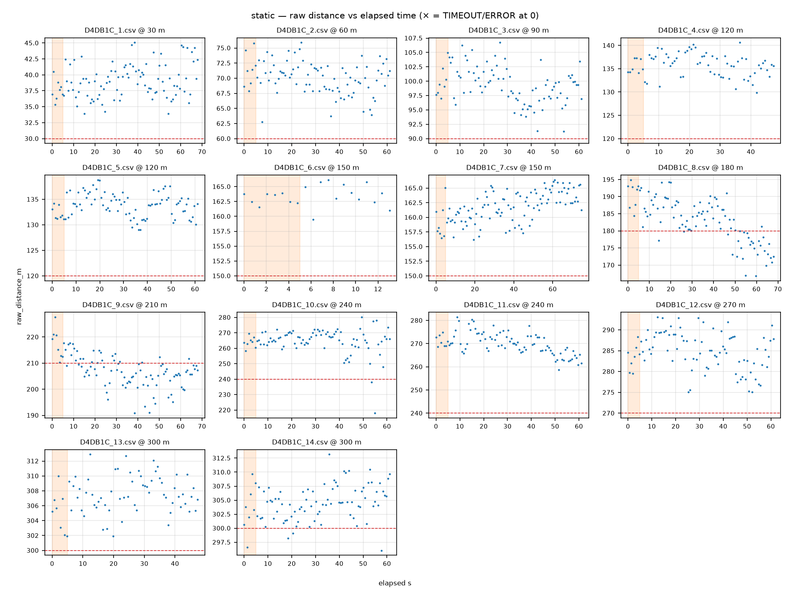

# QC report — run `static` (static)

- Session dir: `data/ranging_experiments/2026-08-22_GMATownship_session02/raw/20260822_162424-Initiator`
- Generated: 2026-09-10 23:36 UTC by qc_session.py v1.0.0 (raw CSVs read-only, unmodified)
- Expected config: 2400.0 MHz, BW 406.25 kHz, SF8, CR 4/7, 12 dBm; N=100/file; cadence 686.0 ms ±5%; drift limit 15.0 m; warm-up window 5.0 s
- Ground truth: session plan `session_plan.json` (operator-supplied; used only where CSV line-2 TRUE_DISTANCE_M is absent)

## Verdict: **HOLD**

HOLD reasons (operator confirmation or action required before this run enters the paper dataset):
- `pucklog_D4DB1C_8.csv`: rolling-median drift range 19.7 m > 15.0 m (walk contamination or forgotten power-off?)
- `pucklog_D4DB1C_9.csv`: rolling-median drift range 15.9 m > 15.0 m (walk contamination or forgotten power-off?)

> The following Methodology §11 discard criteria are **not machine-checkable from CSVs** and must be confirmed against the session log: (a) cone moved mid-session without re-measurement; (b) material weather change mid-session (rain start, wind category shift). This tool checks only: firmware reboot / power-loss evidence (short or truncated files), and the >10-consecutive-ERROR abort criterion.

## 1. Manifest integrity

| file | manifest expected | manifest actual | on-disk | status | ok |
|---|---|---|---|---|---|
| `pucklog_D4DB1C_1.csv` | 4422 | 4422 | 4422 | OK | ✓ |
| `pucklog_D4DB1C_2.csv` | 4001 | 4001 | 4001 | OK | ✓ |
| `pucklog_D4DB1C_3.csv` | 4038 | 4038 | 4038 | OK | ✓ |
| `pucklog_D4DB1C_4.csv` | 3231 | 3231 | 3231 | OK | ✓ |
| `pucklog_D4DB1C_5.csv` | 4091 | 4091 | 4091 | OK | ✓ |
| `pucklog_D4DB1C_6.csv` | 1081 | 1081 | 1081 | OK | ✓ |
| `pucklog_D4DB1C_7.csv` | 4962 | 4962 | 4962 | OK | ✓ |
| `pucklog_D4DB1C_8.csv` | 4522 | 4522 | 4522 | OK | ✓ |
| `pucklog_D4DB1C_9.csv` | 4522 | 4522 | 4522 | OK | ✓ |
| `pucklog_D4DB1C_10.csv` | 4091 | 4091 | 4091 | OK | ✓ |
| `pucklog_D4DB1C_11.csv` | 4091 | 4091 | 4091 | OK | ✓ |
| `pucklog_D4DB1C_12.csv` | 4091 | 4091 | 4091 | OK | ✓ |
| `pucklog_D4DB1C_13.csv` | 3231 | 3231 | 3231 | OK | ✓ |
| `pucklog_D4DB1C_14.csv` | 4091 | 4091 | 4091 | OK | ✓ |

## 2. Per-file checks

| file | truth (src) | N | vs spec | cadence ms | S / T / E (rate) | max ERR streak | drift m | flags |
|---|---|---|---|---|---|---|---|---|
| `pucklog_D4DB1C_1.csv` | 30.0 (session-plan) | 100 | OK | 686 | 100 (100%) / 0 (0%) / 0 (0%) | 0 | 5.5 | 1 |
| `pucklog_D4DB1C_2.csv` | 60.0 (session-plan) | 90 | -10 | 686 | 90 (100%) / 0 (0%) / 0 (0%) | 0 | 3.8 | 2 |
| `pucklog_D4DB1C_3.csv` | 90.0 (session-plan) | 90 | -10 | 686 | 90 (100%) / 0 (0%) / 0 (0%) | 0 | 6.0 | 2 |
| `pucklog_D4DB1C_4.csv` | 120.0 (session-plan) | 70 | -30 DISCARDED | 686 | 70 (100%) / 0 (0%) / 0 (0%) | 0 | 4.3 | 2 |
| `pucklog_D4DB1C_5.csv` | 120.0 (session-plan) | 90 | -10 | 686 | 90 (100%) / 0 (0%) / 0 (0%) | 0 | 5.4 | 2 |
| `pucklog_D4DB1C_6.csv` | 150.0 (session-plan) | 20 | -80 DISCARDED | 686 | 20 (100%) / 0 (0%) / 0 (0%) | 0 | 0.9 | 3 |
| `pucklog_D4DB1C_7.csv` | 150.0 (session-plan) | 110 | OK | 686 | 110 (100%) / 0 (0%) / 0 (0%) | 0 | 6.9 | 1 |
| `pucklog_D4DB1C_8.csv` | 180.0 (session-plan) | 100 | OK | 686 | 100 (100%) / 0 (0%) / 0 (0%) | 0 | 19.7 | 2 |
| `pucklog_D4DB1C_9.csv` | 210.0 (session-plan) | 100 | OK | 686 | 100 (100%) / 0 (0%) / 0 (0%) | 0 | 15.9 | 2 |
| `pucklog_D4DB1C_10.csv` | 240.0 (session-plan) | 90 | -10 DISCARDED | 686 | 90 (100%) / 0 (0%) / 0 (0%) | 0 | 7.1 | 2 |
| `pucklog_D4DB1C_11.csv` | 240.0 (session-plan) | 90 | -10 | 686 | 90 (100%) / 0 (0%) / 0 (0%) | 0 | 12.5 | 2 |
| `pucklog_D4DB1C_12.csv` | 270.0 (session-plan) | 90 | -10 | 686 | 90 (100%) / 0 (0%) / 0 (0%) | 0 | 11.3 | 2 |
| `pucklog_D4DB1C_13.csv` | 300.0 (session-plan) | 70 | -30 DISCARDED | 686 | 70 (100%) / 0 (0%) / 0 (0%) | 0 | 3.9 | 2 |
| `pucklog_D4DB1C_14.csv` | 300.0 (session-plan) | 90 | -10 | 686 | 90 (100%) / 0 (0%) / 0 (0%) | 0 | 5.0 | 2 |

All three outcomes count toward the attempt denominator.

### radio_status_code distribution (non-SUCCESS rows)

No non-SUCCESS rows in this run.

## 3. Warm-up (first 5 s vs remainder, SUCCESS rows)

| file | warm-up rows | warm-up median m | rest median m | delta m |
|---|---|---|---|---|
| `pucklog_D4DB1C_1.csv` | 8 | 37.3 | 38.9 | -1.6 |
| `pucklog_D4DB1C_2.csv` | 8 | 71.3 | 70.1 | +1.2 |
| `pucklog_D4DB1C_3.csv` | 8 | 99.2 | 99.3 | -0.1 |
| `pucklog_D4DB1C_4.csv` | 8 | 134.9 | 136.2 | -1.3 |
| `pucklog_D4DB1C_5.csv` | 8 | 131.7 | 134.0 | -2.3 |
| `pucklog_D4DB1C_6.csv` | 8 | 163.0 | 163.9 | -0.9 |
| `pucklog_D4DB1C_7.csv` | 8 | 157.9 | 162.1 | -4.2 |
| `pucklog_D4DB1C_8.csv` | 8 | 192.5 | 183.3 | +9.1 |
| `pucklog_D4DB1C_9.csv` | 8 | 217.2 | 206.7 | +10.5 |
| `pucklog_D4DB1C_10.csv` | 8 | 263.9 | 266.0 | -2.1 |
| `pucklog_D4DB1C_11.csv` | 8 | 270.6 | 269.7 | +0.9 |
| `pucklog_D4DB1C_12.csv` | 8 | 283.9 | 285.3 | -1.4 |
| `pucklog_D4DB1C_13.csv` | 8 | 305.5 | 307.5 | -2.0 |
| `pucklog_D4DB1C_14.csv` | 8 | 303.5 | 304.6 | -1.1 |

Sanity check for the Methodology §7.2 first-5-s discard rule; large deltas indicate the discard window matters for that file.

## 4. Per-marker statistics (SUCCESS rows)

| marker m | file | n | median m | Q1–Q3 m | IQR m | min m | max m | median RSSI | signed err m |
|---|---|---|---|---|---|---|---|---|---|
| 30 | `pucklog_D4DB1C_1.csv` | 100 | 38.9 | 37.0–40.6 | 3.6 | 33.9 | 45.1 | -66 | +8.9 |
| 60 | `pucklog_D4DB1C_2.csv` | 90 | 70.3 | 68.4–71.8 | 3.4 | 62.7 | 75.9 | -71 | +10.3 |
| 90 | `pucklog_D4DB1C_3.csv` | 90 | 99.3 | 97.1–101.3 | 4.2 | 91.2 | 106.7 | -71 | +9.3 |
| 120 | `pucklog_D4DB1C_5.csv` | 90 | 134.0 | 131.9–135.3 | 3.4 | 129.0 | 138.8 | -76 | +14.0 |
| 150 | `pucklog_D4DB1C_7.csv` | 110 | 161.9 | 159.8–164.1 | 4.3 | 156.2 | 166.4 | -79 | +11.9 |
| 180 | `pucklog_D4DB1C_8.csv` | 100 | 184.0 | 179.2–187.7 | 8.5 | 166.9 | 194.9 | -87 | +4.0 |
| 210 | `pucklog_D4DB1C_9.csv` | 100 | 207.3 | 203.7–211.0 | 7.3 | 190.8 | 227.6 | -87 | -2.7 |
| 240 | `pucklog_D4DB1C_11.csv` | 90 | 269.9 | 266.9–273.2 | 6.3 | 258.7 | 281.4 | -88 | +29.9 |
| 270 | `pucklog_D4DB1C_12.csv` | 90 | 285.0 | 282.0–288.3 | 6.3 | 275.0 | 293.1 | -89 | +15.0 |
| 300 | `pucklog_D4DB1C_14.csv` | 90 | 304.6 | 302.2–306.6 | 4.3 | 296.0 | 313.2 | -89 | +4.6 |

Ground-truth source(s): session-plan.

## 5. Deviations and anomalies

- `pucklog_D4DB1C_1.csv`: operator metadata line (line 2) absent — SITE/RUN_ID/TRUE_DISTANCE_M not recorded in file (Methodology §7.4 step incomplete)
- `pucklog_D4DB1C_2.csv`: operator metadata line (line 2) absent — SITE/RUN_ID/TRUE_DISTANCE_M not recorded in file (Methodology §7.4 step incomplete)
- `pucklog_D4DB1C_2.csv`: N=90 attempts vs spec N=100 (shortfall 10)
- `pucklog_D4DB1C_3.csv`: operator metadata line (line 2) absent — SITE/RUN_ID/TRUE_DISTANCE_M not recorded in file (Methodology §7.4 step incomplete)
- `pucklog_D4DB1C_3.csv`: N=90 attempts vs spec N=100 (shortfall 10)
- `pucklog_D4DB1C_4.csv`: operator metadata line (line 2) absent — SITE/RUN_ID/TRUE_DISTANCE_M not recorded in file (Methodology §7.4 step incomplete)
- `pucklog_D4DB1C_4.csv`: N=70 attempts vs spec N=100 (shortfall 30)
- `pucklog_D4DB1C_5.csv`: operator metadata line (line 2) absent — SITE/RUN_ID/TRUE_DISTANCE_M not recorded in file (Methodology §7.4 step incomplete)
- `pucklog_D4DB1C_5.csv`: N=90 attempts vs spec N=100 (shortfall 10)
- `pucklog_D4DB1C_6.csv`: operator metadata line (line 2) absent — SITE/RUN_ID/TRUE_DISTANCE_M not recorded in file (Methodology §7.4 step incomplete)
- `pucklog_D4DB1C_6.csv`: N=20 attempts vs spec N=100 (shortfall 80)
- `pucklog_D4DB1C_6.csv`: only 20 attempts (<50% of spec) — possible mid-run power-cycle/reboot; operator disposition: DISCARDED (field notes (2026-08-22): '150m retake - car interference.' Superseded by pucklog_D4DB1C_7.csv) — excluded from per-marker stats; move to data/discarded/ at archive time (Methodology §11)
- `pucklog_D4DB1C_7.csv`: operator metadata line (line 2) absent — SITE/RUN_ID/TRUE_DISTANCE_M not recorded in file (Methodology §7.4 step incomplete)
- **HOLD** `pucklog_D4DB1C_8.csv`: rolling-median drift range 19.7 m > 15.0 m (walk contamination or forgotten power-off?)
- `pucklog_D4DB1C_8.csv`: operator metadata line (line 2) absent — SITE/RUN_ID/TRUE_DISTANCE_M not recorded in file (Methodology §7.4 step incomplete)
- **HOLD** `pucklog_D4DB1C_9.csv`: rolling-median drift range 15.9 m > 15.0 m (walk contamination or forgotten power-off?)
- `pucklog_D4DB1C_9.csv`: operator metadata line (line 2) absent — SITE/RUN_ID/TRUE_DISTANCE_M not recorded in file (Methodology §7.4 step incomplete)
- `pucklog_D4DB1C_10.csv`: operator metadata line (line 2) absent — SITE/RUN_ID/TRUE_DISTANCE_M not recorded in file (Methodology §7.4 step incomplete)
- `pucklog_D4DB1C_10.csv`: N=90 attempts vs spec N=100 (shortfall 10)
- `pucklog_D4DB1C_11.csv`: operator metadata line (line 2) absent — SITE/RUN_ID/TRUE_DISTANCE_M not recorded in file (Methodology §7.4 step incomplete)
- `pucklog_D4DB1C_11.csv`: N=90 attempts vs spec N=100 (shortfall 10)
- `pucklog_D4DB1C_12.csv`: operator metadata line (line 2) absent — SITE/RUN_ID/TRUE_DISTANCE_M not recorded in file (Methodology §7.4 step incomplete)
- `pucklog_D4DB1C_12.csv`: N=90 attempts vs spec N=100 (shortfall 10)
- `pucklog_D4DB1C_13.csv`: operator metadata line (line 2) absent — SITE/RUN_ID/TRUE_DISTANCE_M not recorded in file (Methodology §7.4 step incomplete)
- `pucklog_D4DB1C_13.csv`: N=70 attempts vs spec N=100 (shortfall 30)
- `pucklog_D4DB1C_14.csv`: operator metadata line (line 2) absent — SITE/RUN_ID/TRUE_DISTANCE_M not recorded in file (Methodology §7.4 step incomplete)
- `pucklog_D4DB1C_14.csv`: N=90 attempts vs spec N=100 (shortfall 10)

