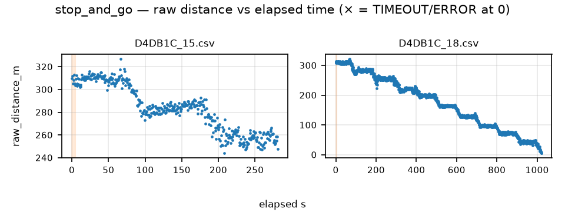

# QC report — run `stop_and_go` (stop_and_go)

- Session dir: `data/ranging_experiments/2026-08-22_GMATownship_session02/raw/20260822_162424-Initiator`
- Generated: 2026-09-10 23:36 UTC by qc_session.py v1.0.0 (raw CSVs read-only, unmodified)
- Expected config: 2400.0 MHz, BW 406.25 kHz, SF8, CR 4/7, 12 dBm; N=100/file; cadence 686.0 ms ±5%; drift limit 15.0 m; warm-up window 5.0 s
- Ground truth: session plan `session_plan.json` (operator-supplied; used only where CSV line-2 TRUE_DISTANCE_M is absent)

## Verdict: **PASS**

No machine-checkable Methodology §11 discard trigger found in this run.

> The following Methodology §11 discard criteria are **not machine-checkable from CSVs** and must be confirmed against the session log: (a) cone moved mid-session without re-measurement; (b) material weather change mid-session (rain start, wind category shift). This tool checks only: firmware reboot / power-loss evidence (short or truncated files), and the >10-consecutive-ERROR abort criterion.

## 1. Manifest integrity

| file | manifest expected | manifest actual | on-disk | status | ok |
|---|---|---|---|---|---|
| `pucklog_D4DB1C_15.csv` | 18434 | 18434 | 18434 | OK | ✓ |
| `pucklog_D4DB1C_18.csv` | 67122 | 67122 | 67122 | OK | ✓ |

## 2. Per-file checks

| file | truth (src) | N | vs spec | cadence ms | S / T / E (rate) | max ERR streak | drift m | flags |
|---|---|---|---|---|---|---|---|---|
| `pucklog_D4DB1C_15.csv` | — | 410 | OK DISCARDED | 686 | 410 (100%) / 0 (0%) / 0 (0%) | 0 | — | 2 |
| `pucklog_D4DB1C_18.csv` | — | 1490 | OK | 686 | 1490 (100%) / 0 (0%) / 0 (0%) | 0 | — | 2 |

All three outcomes count toward the attempt denominator.

### radio_status_code distribution (non-SUCCESS rows)

No non-SUCCESS rows in this run.

## 3. Warm-up (first 5 s vs remainder, SUCCESS rows)

| file | warm-up rows | warm-up median m | rest median m | delta m |
|---|---|---|---|---|
| `pucklog_D4DB1C_15.csv` | 8 | 306.8 | 283.2 | +23.6 |
| `pucklog_D4DB1C_18.csv` | 8 | 311.6 | 167.7 | +143.9 |

Sanity check for the Methodology §7.2 first-5-s discard rule; large deltas indicate the discard window matters for that file.

## 4. Dwell segmentation (heuristic)

Stationary plateaus detected via rolling-median slope < 5.0 m over ±5 cycles, minimum 30 cycles. Segment→marker matching is nearest-marker; verify against the session log.

| window s | matched marker | attempts | T / E | median m | IQR m | median RSSI |
|---|---|---|---|---|---|---|
| 0–76 | 300 | 112 | 0 / 0 | 309.6 | 4.2 | -88 |
| 98–179 | 270 | 119 | 0 / 0 | 284.0 | 5.3 | -87 |
| 0–71 | 300 | 104 | 0 / 0 | 309.8 | 4.8 | -87 |
| 105–169 | 270 | 95 | 0 / 0 | 282.6 | 4.7 | -88 |
| 211–259 | 270 | 72 | 0 / 0 | 255.3 | 7.0 | -86 |
| 261–283 | 270 | 34 | 0 / 0 | 256.7 | 4.5 | -86 |
| 320–374 | 210 | 80 | 0 / 0 | 220.3 | 6.6 | -85 |
| 409–486 | 210 | 113 | 0 / 0 | 199.6 | 4.1 | -83 |
| 515–592 | 150 | 114 | 0 / 0 | 163.8 | 3.2 | -77 |
| 618–692 | 120 | 109 | 0 / 0 | 128.8 | 3.4 | -76 |
| 716–799 | 90 | 122 | 0 / 0 | 97.0 | 2.9 | -71 |
| 814–893 | 60 | 116 | 0 / 0 | 72.6 | 4.6 | -73 |
| 915–991 | 30 | 112 | 0 / 0 | 42.5 | 4.1 | -66 |

## 5. Per-marker statistics (SUCCESS rows)

| marker m | file | n | median m | Q1–Q3 m | IQR m | min m | max m | median RSSI | signed err m |
|---|---|---|---|---|---|---|---|---|---|
| 30 | `pucklog_D4DB1C_18.csv` | 112 | 42.5 | 41.1–45.2 | 4.1 | 30.8 | 49.3 | -66 | +12.5 |
| 60 | `pucklog_D4DB1C_18.csv` | 116 | 72.6 | 70.4–75.0 | 4.6 | 66.4 | 79.5 | -73 | +12.6 |
| 90 | `pucklog_D4DB1C_18.csv` | 122 | 97.0 | 95.4–98.3 | 2.9 | 91.7 | 104.7 | -71 | +7.0 |
| 120 | `pucklog_D4DB1C_18.csv` | 109 | 128.8 | 127.4–130.8 | 3.4 | 123.7 | 140.0 | -76 | +8.8 |
| 150 | `pucklog_D4DB1C_18.csv` | 114 | 163.8 | 161.9–165.1 | 3.2 | 158.9 | 168.7 | -77 | +13.8 |
| 210 | `pucklog_D4DB1C_18.csv` | 80 | 220.3 | 216.1–222.7 | 6.6 | 208.4 | 226.4 | -85 | +10.3 |
| 210 | `pucklog_D4DB1C_18.csv` | 113 | 199.6 | 197.4–201.5 | 4.1 | 191.7 | 213.6 | -83 | -10.4 |
| 270 | `pucklog_D4DB1C_18.csv` | 95 | 282.6 | 280.8–285.6 | 4.7 | 276.2 | 293.7 | -88 | +12.6 |
| 270 | `pucklog_D4DB1C_18.csv` | 72 | 255.3 | 252.3–259.3 | 7.0 | 248.0 | 266.6 | -86 | -14.7 |
| 270 | `pucklog_D4DB1C_18.csv` | 34 | 256.7 | 254.7–259.1 | 4.5 | 248.9 | 263.6 | -86 | -13.3 |
| 300 | `pucklog_D4DB1C_18.csv` | 104 | 309.8 | 307.5–312.3 | 4.8 | 303.5 | 322.6 | -87 | +9.8 |

Ground-truth source(s): plan markers + dwell match.

## 6. Deviations and anomalies

- `pucklog_D4DB1C_15.csv`: operator metadata line (line 2) absent — SITE/RUN_ID/TRUE_DISTANCE_M not recorded in file (Methodology §7.4 step incomplete)
- `pucklog_D4DB1C_15.csv`: no dwell segment detected for marker(s) 30, 60, 90, 120, 150, 180, 210, 240 m (heuristic segmentation — verify against session log)
- `pucklog_D4DB1C_18.csv`: operator metadata line (line 2) absent — SITE/RUN_ID/TRUE_DISTANCE_M not recorded in file (Methodology §7.4 step incomplete)
- `pucklog_D4DB1C_18.csv`: no dwell segment detected for marker(s) 180, 240 m (heuristic segmentation — verify against session log)

