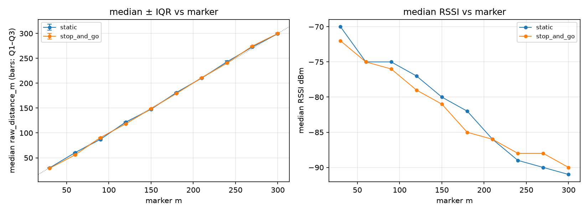

# Outing summary — run comparison at matched markers

- Session dir: `data/ranging_experiments/2026-08-22_GMATownship_session02/raw/20260822_174415-Initiator`
- Generated: 2026-09-10 23:36 UTC by qc_session.py v1.0.0
- Run `static`: **PASS** (see `static/report.md`)
- Run `stop_and_go`: **PASS** (see `stop_and_go/report.md`)

| marker m | static median m | static IQR m | static err m | static T% | static RSSI | stop_and_go median m | stop_and_go IQR m | stop_and_go err m | stop_and_go T% | stop_and_go RSSI |
|---|---|---|---|---|---|---|---|---|---|---|
| 30 | 29.8 | 1.1 | -0.2 | 0 | -70 | 29.0 | 1.1 | -1.0 | 0 | -72 |
| 60 | 60.4 | 1.2 | +0.4 | 0 | -75 | 55.9 | 1.9 | -4.1 | 0 | -75 |
| 90 | 87.1 | 2.0 | -2.9 | 0 | -75 | 90.6 | 1.4 | +0.6 | 0 | -76 |
| 120 | 121.9 | 1.1 | +1.9 | 0 | -77 | 118.3 | 1.3 | -1.7 | 0 | -79 |
| 150 | 147.5 | 1.3 | -2.5 | 0 | -80 | 148.7 | 1.9 | -1.3 | 0 | -81 |
| 180 | 181.3 | 1.6 | +1.3 | 0 | -82 | 179.3 | 2.3 | -0.7 | 0 | -85 |
| 210 | 210.6 | 1.9 | +0.6 | 0 | -86 | 211.3 | 1.1 | +1.3 | 0 | -86 |
| 240 | 243.2 | 3.2 | +3.2 | 0 | -89 | 240.7 | 3.4 | +0.7 | 0 | -88 |
| 270 | 272.9 | 1.8 | +2.9 | 0 | -90 | 274.8 | 1.5 | +4.8 | 0 | -88 |
| 300 | 299.3 | 2.1 | -0.7 | 0 | -91 | 299.8 | 2.9 | -0.2 | 0 | -90 |

Timeout % uses the all-outcomes attempt denominator. Stop-and-go rows come from heuristic dwell segmentation — verify marker matching against the session log.

