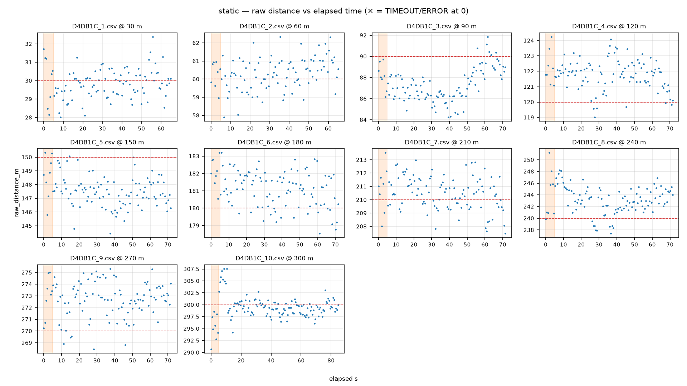

# QC report — run `static` (static)

- Session dir: `data/ranging_experiments/2026-08-22_GMATownship_session02/raw/20260822_174415-Initiator`
- Generated: 2026-09-10 23:36 UTC by qc_session.py v1.0.0 (raw CSVs read-only, unmodified)
- Expected config: 2400.0 MHz, BW 1625.0 kHz, SF8, CR 4/7, 12 dBm; N=100/file; cadence 655.0 ms ±5%; drift limit 15.0 m; warm-up window 5.0 s
- Ground truth: session plan `session_plan.json` (operator-supplied; used only where CSV line-2 TRUE_DISTANCE_M is absent)

## Verdict: **PASS**

No machine-checkable Methodology §11 discard trigger found in this run.

> The following Methodology §11 discard criteria are **not machine-checkable from CSVs** and must be confirmed against the session log: (a) cone moved mid-session without re-measurement; (b) material weather change mid-session (rain start, wind category shift). This tool checks only: firmware reboot / power-loss evidence (short or truncated files), and the >10-consecutive-ERROR abort criterion.

## 1. Manifest integrity

| file | manifest expected | manifest actual | on-disk | status | ok |
|---|---|---|---|---|---|
| `pucklog_D4DB1C_1.csv` | 4422 | 4422 | 4422 | OK | ✓ |
| `pucklog_D4DB1C_2.csv` | 4422 | 4422 | 4422 | OK | ✓ |
| `pucklog_D4DB1C_3.csv` | 4852 | 4852 | 4852 | OK | ✓ |
| `pucklog_D4DB1C_4.csv` | 4962 | 4962 | 4962 | OK | ✓ |
| `pucklog_D4DB1C_5.csv` | 4962 | 4962 | 4962 | OK | ✓ |
| `pucklog_D4DB1C_6.csv` | 4962 | 4962 | 4962 | OK | ✓ |
| `pucklog_D4DB1C_7.csv` | 4962 | 4962 | 4962 | OK | ✓ |
| `pucklog_D4DB1C_8.csv` | 4962 | 4962 | 4962 | OK | ✓ |
| `pucklog_D4DB1C_9.csv` | 4962 | 4962 | 4962 | OK | ✓ |
| `pucklog_D4DB1C_10.csv` | 5842 | 5842 | 5842 | OK | ✓ |

## 2. Per-file checks

| file | truth (src) | N | vs spec | cadence ms | S / T / E (rate) | max ERR streak | drift m | flags |
|---|---|---|---|---|---|---|---|---|
| `pucklog_D4DB1C_1.csv` | 30.0 (session-plan) | 100 | OK | 655 | 100 (100%) / 0 (0%) / 0 (0%) | 0 | 1.1 | 1 |
| `pucklog_D4DB1C_2.csv` | 60.0 (session-plan) | 100 | OK | 656 | 100 (100%) / 0 (0%) / 0 (0%) | 0 | 1.1 | 1 |
| `pucklog_D4DB1C_3.csv` | 90.0 (session-plan) | 110 | OK | 656 | 110 (100%) / 0 (0%) / 0 (0%) | 0 | 3.9 | 1 |
| `pucklog_D4DB1C_4.csv` | 120.0 (session-plan) | 110 | OK | 655 | 110 (100%) / 0 (0%) / 0 (0%) | 0 | 2.2 | 1 |
| `pucklog_D4DB1C_5.csv` | 150.0 (session-plan) | 110 | OK | 656 | 110 (100%) / 0 (0%) / 0 (0%) | 0 | 2.5 | 1 |
| `pucklog_D4DB1C_6.csv` | 180.0 (session-plan) | 110 | OK | 655 | 110 (100%) / 0 (0%) / 0 (0%) | 0 | 2.1 | 1 |
| `pucklog_D4DB1C_7.csv` | 210.0 (session-plan) | 110 | OK | 655 | 110 (100%) / 0 (0%) / 0 (0%) | 0 | 2.1 | 1 |
| `pucklog_D4DB1C_8.csv` | 240.0 (session-plan) | 110 | OK | 655 | 110 (100%) / 0 (0%) / 0 (0%) | 0 | 5.0 | 1 |
| `pucklog_D4DB1C_9.csv` | 270.0 (session-plan) | 110 | OK | 656 | 110 (100%) / 0 (0%) / 0 (0%) | 0 | 2.1 | 1 |
| `pucklog_D4DB1C_10.csv` | 300.0 (session-plan) | 130 | OK | 655 | 130 (100%) / 0 (0%) / 0 (0%) | 0 | 9.2 | 1 |

All three outcomes count toward the attempt denominator.

### radio_status_code distribution (non-SUCCESS rows)

No non-SUCCESS rows in this run.

## 3. Warm-up (first 5 s vs remainder, SUCCESS rows)

| file | warm-up rows | warm-up median m | rest median m | delta m |
|---|---|---|---|---|
| `pucklog_D4DB1C_1.csv` | 8 | 30.4 | 29.8 | +0.7 |
| `pucklog_D4DB1C_2.csv` | 8 | 60.5 | 60.4 | +0.1 |
| `pucklog_D4DB1C_3.csv` | 8 | 88.1 | 87.0 | +1.1 |
| `pucklog_D4DB1C_4.csv` | 8 | 122.0 | 121.9 | +0.1 |
| `pucklog_D4DB1C_5.csv` | 8 | 148.8 | 147.4 | +1.4 |
| `pucklog_D4DB1C_6.csv` | 8 | 182.1 | 181.2 | +0.9 |
| `pucklog_D4DB1C_7.csv` | 8 | 211.1 | 210.5 | +0.6 |
| `pucklog_D4DB1C_8.csv` | 8 | 243.4 | 243.2 | +0.2 |
| `pucklog_D4DB1C_9.csv` | 8 | 273.3 | 272.9 | +0.4 |
| `pucklog_D4DB1C_10.csv` | 8 | 295.3 | 299.4 | -4.1 |

Sanity check for the Methodology §7.2 first-5-s discard rule; large deltas indicate the discard window matters for that file.

## 4. Per-marker statistics (SUCCESS rows)

| marker m | file | n | median m | Q1–Q3 m | IQR m | min m | max m | median RSSI | signed err m |
|---|---|---|---|---|---|---|---|---|---|
| 30 | `pucklog_D4DB1C_1.csv` | 100 | 29.8 | 29.3–30.4 | 1.1 | 28.0 | 32.4 | -70 | -0.2 |
| 60 | `pucklog_D4DB1C_2.csv` | 100 | 60.4 | 59.8–61.0 | 1.2 | 57.9 | 62.3 | -75 | +0.4 |
| 90 | `pucklog_D4DB1C_3.csv` | 110 | 87.1 | 86.2–88.3 | 2.0 | 84.2 | 91.9 | -75 | -2.9 |
| 120 | `pucklog_D4DB1C_4.csv` | 110 | 121.9 | 121.3–122.4 | 1.1 | 119.0 | 124.2 | -77 | +1.9 |
| 150 | `pucklog_D4DB1C_5.csv` | 110 | 147.5 | 146.8–148.2 | 1.3 | 144.5 | 150.3 | -80 | -2.5 |
| 180 | `pucklog_D4DB1C_6.csv` | 110 | 181.3 | 180.3–181.9 | 1.6 | 178.6 | 183.2 | -82 | +1.3 |
| 210 | `pucklog_D4DB1C_7.csv` | 110 | 210.6 | 209.6–211.5 | 1.9 | 207.5 | 213.5 | -86 | +0.6 |
| 240 | `pucklog_D4DB1C_8.csv` | 110 | 243.2 | 241.7–244.9 | 3.2 | 237.4 | 251.2 | -89 | +3.2 |
| 270 | `pucklog_D4DB1C_9.csv` | 110 | 272.9 | 271.9–273.7 | 1.8 | 268.4 | 275.3 | -90 | +2.9 |
| 300 | `pucklog_D4DB1C_10.csv` | 130 | 299.3 | 298.2–300.3 | 2.1 | 290.7 | 307.5 | -91 | -0.7 |

Ground-truth source(s): session-plan.

## 5. Deviations and anomalies

- `pucklog_D4DB1C_1.csv`: operator metadata line (line 2) absent — SITE/RUN_ID/TRUE_DISTANCE_M not recorded in file (Methodology §7.4 step incomplete)
- `pucklog_D4DB1C_2.csv`: operator metadata line (line 2) absent — SITE/RUN_ID/TRUE_DISTANCE_M not recorded in file (Methodology §7.4 step incomplete)
- `pucklog_D4DB1C_3.csv`: operator metadata line (line 2) absent — SITE/RUN_ID/TRUE_DISTANCE_M not recorded in file (Methodology §7.4 step incomplete)
- `pucklog_D4DB1C_4.csv`: operator metadata line (line 2) absent — SITE/RUN_ID/TRUE_DISTANCE_M not recorded in file (Methodology §7.4 step incomplete)
- `pucklog_D4DB1C_5.csv`: operator metadata line (line 2) absent — SITE/RUN_ID/TRUE_DISTANCE_M not recorded in file (Methodology §7.4 step incomplete)
- `pucklog_D4DB1C_6.csv`: operator metadata line (line 2) absent — SITE/RUN_ID/TRUE_DISTANCE_M not recorded in file (Methodology §7.4 step incomplete)
- `pucklog_D4DB1C_7.csv`: operator metadata line (line 2) absent — SITE/RUN_ID/TRUE_DISTANCE_M not recorded in file (Methodology §7.4 step incomplete)
- `pucklog_D4DB1C_8.csv`: operator metadata line (line 2) absent — SITE/RUN_ID/TRUE_DISTANCE_M not recorded in file (Methodology §7.4 step incomplete)
- `pucklog_D4DB1C_9.csv`: operator metadata line (line 2) absent — SITE/RUN_ID/TRUE_DISTANCE_M not recorded in file (Methodology §7.4 step incomplete)
- `pucklog_D4DB1C_10.csv`: operator metadata line (line 2) absent — SITE/RUN_ID/TRUE_DISTANCE_M not recorded in file (Methodology §7.4 step incomplete)

