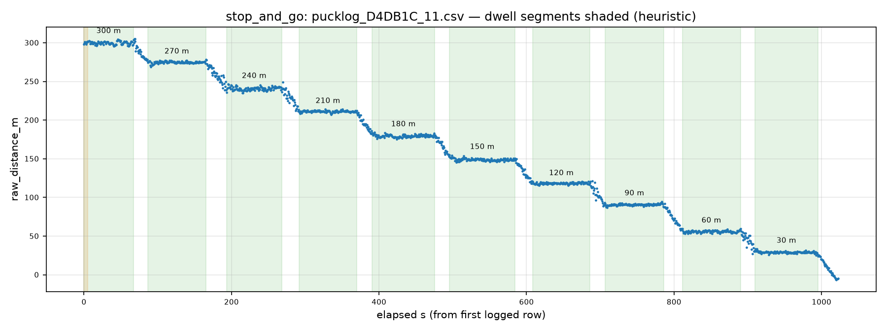

# QC report — run `stop_and_go` (stop_and_go)

- Session dir: `data/ranging_experiments/2026-08-22_GMATownship_session02/raw/20260822_174415-Initiator`
- Generated: 2026-09-10 23:36 UTC by qc_session.py v1.0.0 (raw CSVs read-only, unmodified)
- Expected config: 2400.0 MHz, BW 1625.0 kHz, SF8, CR 4/7, 12 dBm; N=100/file; cadence 655.0 ms ±5%; drift limit 15.0 m; warm-up window 5.0 s
- Ground truth: session plan `session_plan.json` (operator-supplied; used only where CSV line-2 TRUE_DISTANCE_M is absent)

## Verdict: **PASS**

No machine-checkable Methodology §11 discard trigger found in this run.

> The following Methodology §11 discard criteria are **not machine-checkable from CSVs** and must be confirmed against the session log: (a) cone moved mid-session without re-measurement; (b) material weather change mid-session (rain start, wind category shift). This tool checks only: firmware reboot / power-loss evidence (short or truncated files), and the >10-consecutive-ERROR abort criterion.

## 1. Manifest integrity

| file | manifest expected | manifest actual | on-disk | status | ok |
|---|---|---|---|---|---|
| `pucklog_D4DB1C_11.csv` | 70278 | 70278 | 70278 | OK | ✓ |

## 2. Per-file checks

| file | truth (src) | N | vs spec | cadence ms | S / T / E (rate) | max ERR streak | drift m | flags |
|---|---|---|---|---|---|---|---|---|
| `pucklog_D4DB1C_11.csv` | — | 1560 | OK | 655 | 1560 (100%) / 0 (0%) / 0 (0%) | 0 | — | 1 |

All three outcomes count toward the attempt denominator.

### radio_status_code distribution (non-SUCCESS rows)

No non-SUCCESS rows in this run.

## 3. Warm-up (first 5 s vs remainder, SUCCESS rows)

| file | warm-up rows | warm-up median m | rest median m | delta m |
|---|---|---|---|---|
| `pucklog_D4DB1C_11.csv` | 8 | 299.8 | 150.2 | +149.6 |

Sanity check for the Methodology §7.2 first-5-s discard rule; large deltas indicate the discard window matters for that file.

## 4. Dwell segmentation (heuristic)

Stationary plateaus detected via rolling-median slope < 5.0 m over ±5 cycles, minimum 30 cycles. Segment→marker matching is nearest-marker; verify against the session log.

| window s | matched marker | attempts | T / E | median m | IQR m | median RSSI |
|---|---|---|---|---|---|---|
| 0–67 | 300 | 103 | 0 / 0 | 299.8 | 2.9 | -90 |
| 87–165 | 270 | 121 | 0 / 0 | 274.8 | 1.5 | -88 |
| 193–268 | 240 | 115 | 0 / 0 | 240.7 | 3.4 | -88 |
| 292–370 | 210 | 120 | 0 / 0 | 211.3 | 1.1 | -86 |
| 391–475 | 180 | 130 | 0 / 0 | 179.3 | 2.3 | -85 |
| 496–584 | 150 | 136 | 0 / 0 | 148.7 | 1.9 | -81 |
| 609–686 | 120 | 119 | 0 / 0 | 118.3 | 1.3 | -79 |
| 706–786 | 90 | 123 | 0 / 0 | 90.6 | 1.4 | -76 |
| 811–890 | 60 | 121 | 0 / 0 | 55.9 | 1.9 | -75 |
| 910–995 | 30 | 131 | 0 / 0 | 29.0 | 1.1 | -72 |

## 5. Per-marker statistics (SUCCESS rows)

| marker m | file | n | median m | Q1–Q3 m | IQR m | min m | max m | median RSSI | signed err m |
|---|---|---|---|---|---|---|---|---|---|
| 30 | `pucklog_D4DB1C_11.csv` | 131 | 29.0 | 28.5–29.6 | 1.1 | 24.2 | 33.5 | -72 | -1.0 |
| 60 | `pucklog_D4DB1C_11.csv` | 121 | 55.9 | 55.0–56.9 | 1.9 | 52.9 | 59.6 | -75 | -4.1 |
| 90 | `pucklog_D4DB1C_11.csv` | 123 | 90.6 | 89.9–91.3 | 1.4 | 86.7 | 94.7 | -76 | +0.6 |
| 120 | `pucklog_D4DB1C_11.csv` | 119 | 118.3 | 117.5–118.9 | 1.3 | 115.5 | 120.8 | -79 | -1.7 |
| 150 | `pucklog_D4DB1C_11.csv` | 136 | 148.7 | 148.0–149.9 | 1.9 | 145.7 | 154.7 | -81 | -1.3 |
| 180 | `pucklog_D4DB1C_11.csv` | 130 | 179.3 | 178.3–180.6 | 2.3 | 175.3 | 184.0 | -85 | -0.7 |
| 210 | `pucklog_D4DB1C_11.csv` | 120 | 211.3 | 210.7–211.9 | 1.1 | 207.1 | 214.2 | -86 | +1.3 |
| 240 | `pucklog_D4DB1C_11.csv` | 115 | 240.7 | 238.9–242.3 | 3.4 | 234.9 | 246.5 | -88 | +0.7 |
| 270 | `pucklog_D4DB1C_11.csv` | 121 | 274.8 | 274.0–275.5 | 1.5 | 268.9 | 278.2 | -88 | +4.8 |
| 300 | `pucklog_D4DB1C_11.csv` | 103 | 299.8 | 298.4–301.3 | 2.9 | 295.3 | 304.6 | -90 | -0.2 |

Ground-truth source(s): plan markers + dwell match.

## 6. Deviations and anomalies

- `pucklog_D4DB1C_11.csv`: operator metadata line (line 2) absent — SITE/RUN_ID/TRUE_DISTANCE_M not recorded in file (Methodology §7.4 step incomplete)

